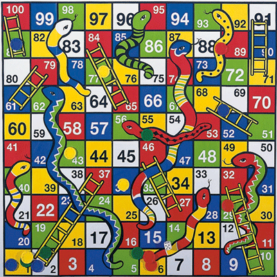

## Snake and Ladder Introduction
- Requirements for building the game include UI elements such as a board, coins, buttons, and a display info area
- Back end logic requirements include a data structure to represent the board, snakes, and ladders, a dice for player movement, and a player with certain properties

